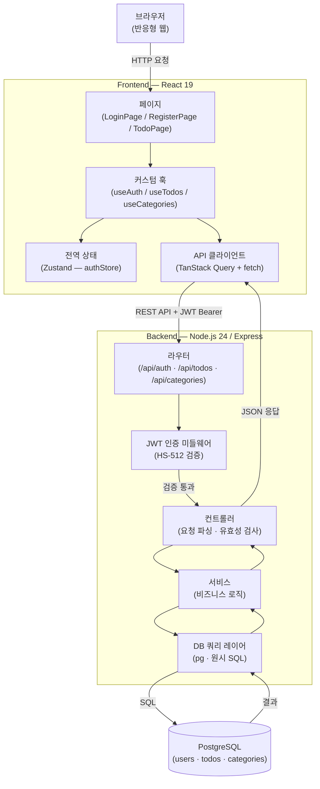
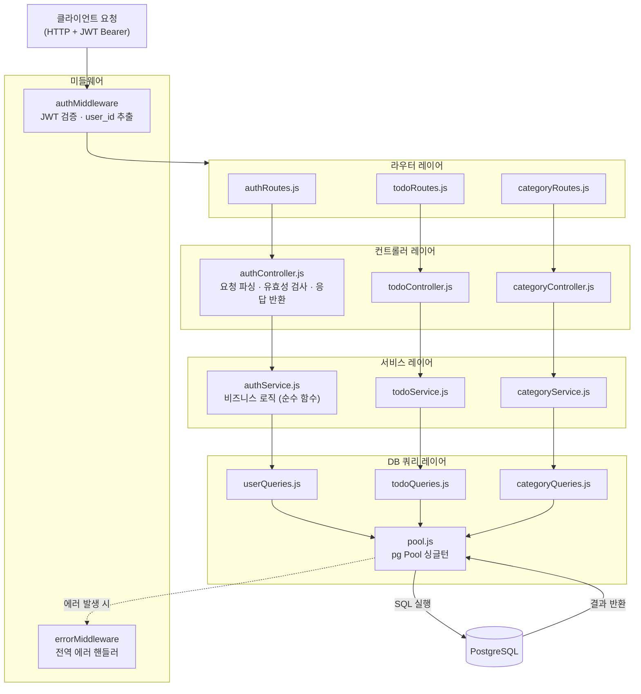
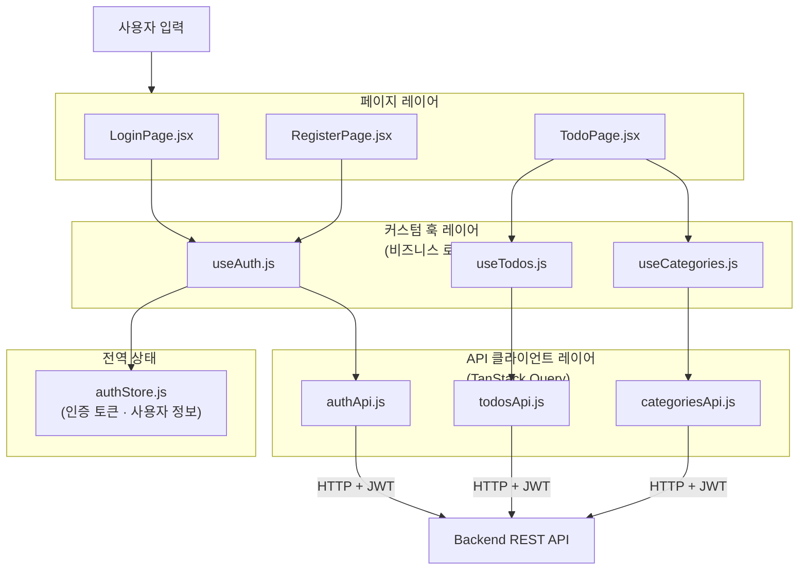
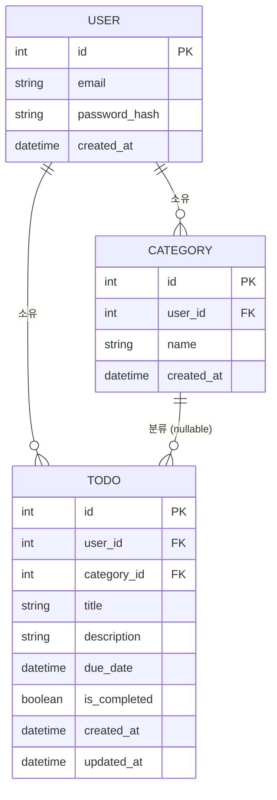

# 기술 아키텍처 다이어그램 — TodoList 애플리케이션

> 참조: [PRD v0.1](./2-prd.md) · [프로젝트 구조 v0.3](./4-project-structure.md)

---

## 변경 이력

| 버전 | 날짜 | 작성자 | 변경 내용 |
|---|---|---|---|
| v0.1 | 2026-04-28 | soominlee | 최초 작성 |
| v0.2 | 2026-04-28 | soominlee | 프론트엔드 레이어 구조도·도메인 모델 추가 |
| v0.3 | 2026-04-28 | soominlee | 기술 스택 및 버전 다이어그램 추가 |
| v0.4 | 2026-04-28 | soominlee | 기술 스택 표 형식으로 변경 |

---

## 1. 기술 스택 및 버전

### Frontend

| 라이브러리 | 버전 | 용도 |
|---|---|---|
| React | 19 | UI 프레임워크 |
| TanStack Query | 5 | 서버 상태 관리 |
| Zustand | 5 | 전역 상태 관리 |
| Tailwind CSS | 4 | 스타일링 |

### Backend

| 라이브러리 | 버전 | 용도 |
|---|---|---|
| Node.js | 24 | 런타임 |
| Express | 5 | 웹 프레임워크 |
| pg (node-postgres) | 최신 | PostgreSQL 클라이언트 |

### Database

| 항목 | 버전 | 용도 |
|---|---|---|
| PostgreSQL | 16 | 관계형 데이터베이스 |

### 인증

| 항목 | 사양 | 용도 |
|---|---|---|
| JWT | HS-512 | 사용자 인증 토큰 |
| bcrypt | salt rounds ≥ 12 | 비밀번호 해싱 |

---

## 2. 시스템 구성도

전체 3-tier 구조와 JWT 인증 흐름을 나타낸다.

---

## 3. 백엔드 레이어 구조도

요청이 각 레이어를 단방향으로 통과하는 흐름을 나타낸다.

---

---

## 4. 프론트엔드 레이어 구조도

요청이 각 레이어를 단방향으로 통과하는 흐름을 나타낸다.

---

## 5. 도메인 모델

핵심 엔티티 간 관계를 나타낸다.

---

> 의존 방향은 항상 단방향이며, 역방향 참조는 금지한다. (P-07)
