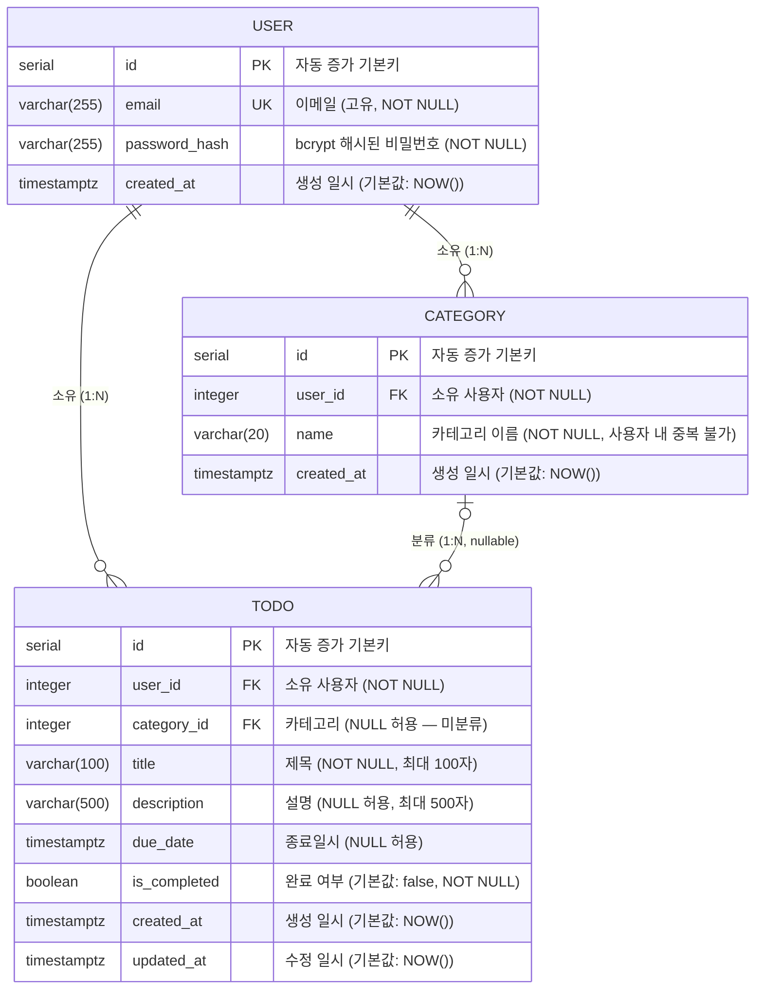

# ERD (Entity Relationship Diagram) — TodoList 개인 할일 관리 애플리케이션

> 참조: [도메인 정의서 v1.0](./1-domain-definition.md) · [PRD v0.1](./2-prd.md) · [프로젝트 구조 v0.3](./4-project-structure.md) · [기술 아키텍처 다이어그램 v0.4](./5-arch-diagram.md)

---

## 변경 이력

| 버전 | 날짜 | 작성자 | 변경 내용 |
|---|---|---|---|
| v0.1 | 2026-04-28 | soominlee | 최초 작성 |

---

## 1. ERD

---

## 2. 테이블 컬럼 상세 설명

### 2.1 USER 테이블

| 컬럼명 | 타입 | 제약조건 | 기본값 | 설명 |
|---|---|---|---|---|
| `id` | `SERIAL` | `PRIMARY KEY` | 자동 증가 | 사용자 고유 식별자 |
| `email` | `VARCHAR(255)` | `NOT NULL`, `UNIQUE` | — | 로그인 ID로 사용되는 이메일. 시스템 전체에서 중복 불가 |
| `password_hash` | `VARCHAR(255)` | `NOT NULL` | — | bcrypt (salt rounds ≥ 12)로 해싱된 비밀번호. 평문 저장 금지 |
| `created_at` | `TIMESTAMPTZ` | `NOT NULL` | `NOW()` | 계정 생성 일시 |

> 도메인 규칙: 이메일은 필수이며 시스템 전체에서 중복 불가 (DR-02). 비밀번호는 8자 이상, 영문/숫자 혼합 필수 (FR-U01).

---

### 2.2 CATEGORY 테이블

| 컬럼명 | 타입 | 제약조건 | 기본값 | 설명 |
|---|---|---|---|---|
| `id` | `SERIAL` | `PRIMARY KEY` | 자동 증가 | 카테고리 고유 식별자 |
| `user_id` | `INTEGER` | `NOT NULL`, `FOREIGN KEY → USER(id)` | — | 카테고리를 소유한 사용자. 사용자 삭제 시 카테고리도 함께 삭제 (CASCADE) |
| `name` | `VARCHAR(20)` | `NOT NULL` | — | 카테고리 이름. 최대 20자. 동일 사용자 내에서 중복 불가 (UNIQUE 복합 제약: `user_id + name`) |
| `created_at` | `TIMESTAMPTZ` | `NOT NULL` | `NOW()` | 카테고리 생성 일시 |

> 도메인 규칙: 카테고리 이름은 같은 사용자 범위 안에서만 중복 불가 (FR-C01). 카테고리 삭제 시 소속 할일의 `category_id`는 `NULL`로 처리되며 할일은 삭제되지 않음 (DR-04, FR-C04).

---

### 2.3 TODO 테이블

| 컬럼명 | 타입 | 제약조건 | 기본값 | 설명 |
|---|---|---|---|---|
| `id` | `SERIAL` | `PRIMARY KEY` | 자동 증가 | 할일 고유 식별자 |
| `user_id` | `INTEGER` | `NOT NULL`, `FOREIGN KEY → USER(id)` | — | 할일을 소유한 사용자. 사용자 삭제 시 할일도 함께 삭제 (CASCADE) |
| `category_id` | `INTEGER` | `NULL 허용`, `FOREIGN KEY → CATEGORY(id)` | `NULL` | 할일이 속한 카테고리. 카테고리 삭제 시 `NULL`로 설정 (SET NULL). `NULL`이면 미분류 상태 |
| `title` | `VARCHAR(100)` | `NOT NULL` | — | 할일 제목. 필수, 최대 100자 |
| `description` | `VARCHAR(500)` | `NULL 허용` | `NULL` | 할일 설명. 선택 입력, 최대 500자 |
| `due_date` | `TIMESTAMPTZ` | `NULL 허용` | `NULL` | 종료 목표 일시. 선택 입력. `NULL`이면 기한 초과 판별 대상에서 제외 |
| `is_completed` | `BOOLEAN` | `NOT NULL` | `false` | 완료 여부. `false`(미완료) / `true`(완료). 기한 초과 판별은 이 값이 `false`이고 `due_date < NOW()`일 때 적용 |
| `created_at` | `TIMESTAMPTZ` | `NOT NULL` | `NOW()` | 할일 생성 일시 |
| `updated_at` | `TIMESTAMPTZ` | `NOT NULL` | `NOW()` | 할일 최종 수정 일시. 수정 시 자동 갱신 |

> 도메인 규칙: 제목은 필수이며 최대 100자 (FR-T01). 설명·종료일은 선택 입력 (DR-05). 완료 여부 기본값은 `false` (FR-T01). 모든 삭제는 영구 삭제(Hard Delete) (DR-06).

---

## 3. 관계 요약

| 관계 | 유형 | 설명 |
|---|---|---|
| `USER` → `CATEGORY` | 1:N | 사용자 한 명이 여러 카테고리를 소유. 사용자 삭제 시 카테고리 CASCADE 삭제 |
| `USER` → `TODO` | 1:N | 사용자 한 명이 여러 할일을 소유. 사용자 삭제 시 할일 CASCADE 삭제 |
| `CATEGORY` → `TODO` | 1:N (nullable) | 카테고리 하나에 여러 할일이 속할 수 있음. 카테고리 삭제 시 `category_id` SET NULL (할일은 유지) |

---

## 4. 주요 제약조건 및 인덱스 설계 지침

| 대상 | 제약조건 / 인덱스 | 목적 |
|---|---|---|
| `USER.email` | `UNIQUE` | 이메일 중복 가입 방지 |
| `(CATEGORY.user_id, CATEGORY.name)` | `UNIQUE` 복합 제약 | 동일 사용자 내 카테고리 이름 중복 방지 |
| `TODO.category_id` | `ON DELETE SET NULL` | 카테고리 삭제 시 할일 미분류 처리 |
| `USER.id`, `CATEGORY.user_id`, `TODO.user_id` | `FOREIGN KEY + CASCADE` | 데이터 무결성 및 소유권 기반 접근 제어 (DR-02) |
| `TODO.user_id` | 인덱스 권장 | 사용자별 할일 목록 조회 성능 |
| `TODO.category_id` | 인덱스 권장 | 카테고리별 할일 필터링 성능 (FR-T06) |
| `TODO.is_completed`, `TODO.due_date` | 복합 인덱스 권장 | 상태 필터 및 기한 초과 판별 성능 (FR-T07, FR-T08) |

---

## 5. 상태(Status) 판별 로직

`Status`는 별도 테이블로 저장하지 않으며, 조회 시점에 아래 로직으로 동적 계산한다 (DR-03).

| 조건 | 상태 |
|---|---|
| `is_completed = true` | 완료 (Completed) |
| `is_completed = false` AND (`due_date IS NULL` OR `due_date >= NOW()`) | 미완료 (Pending) |
| `is_completed = false` AND `due_date < NOW()` | 기한 초과 (Overdue) |
